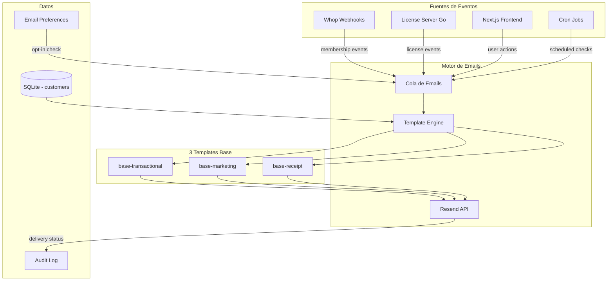
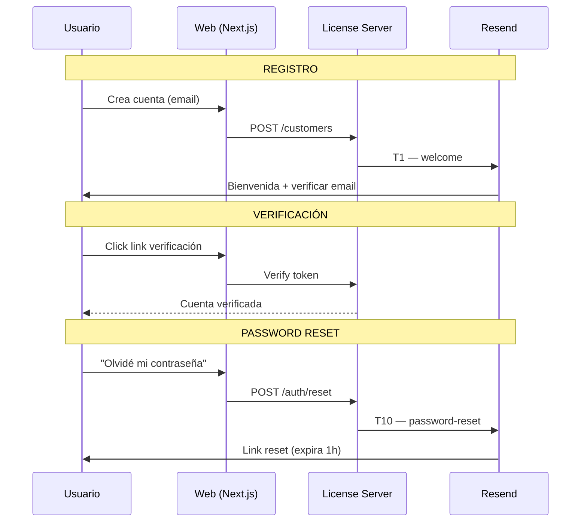
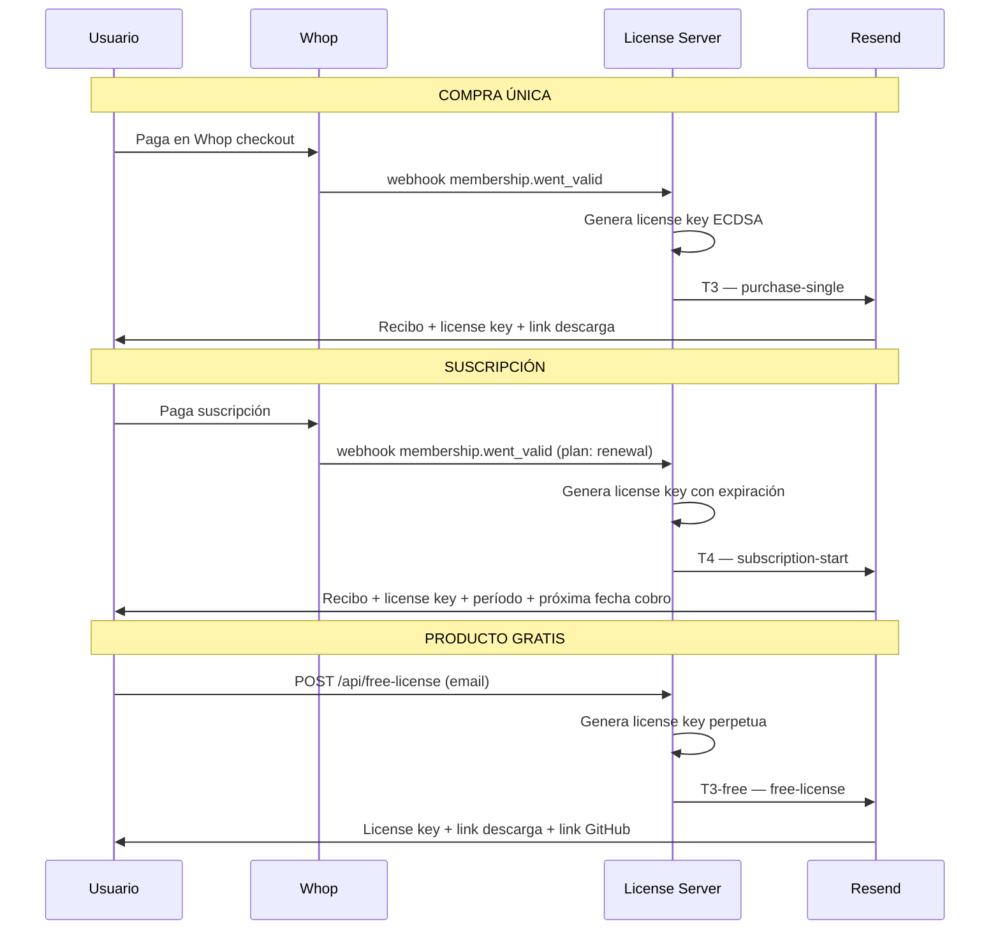
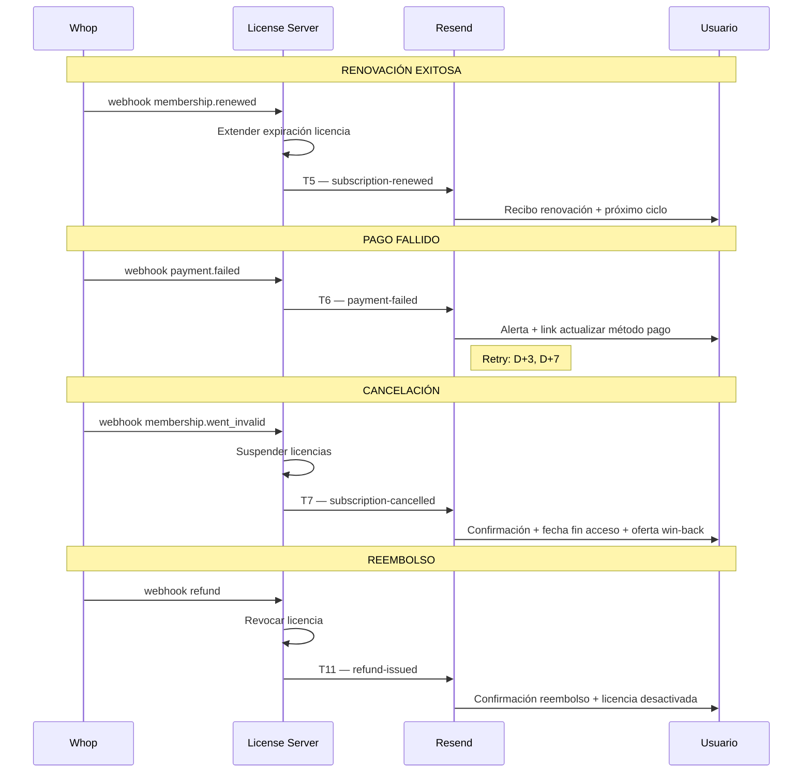
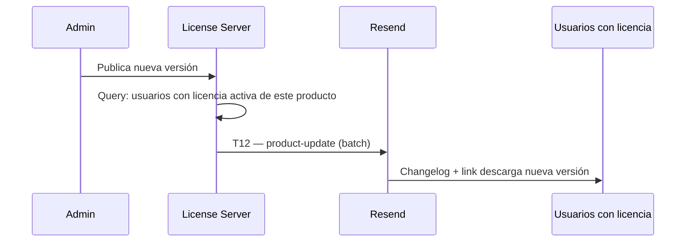
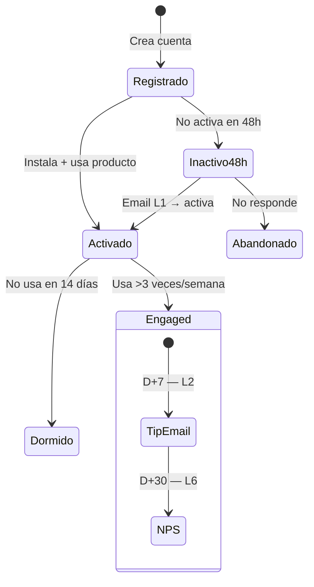
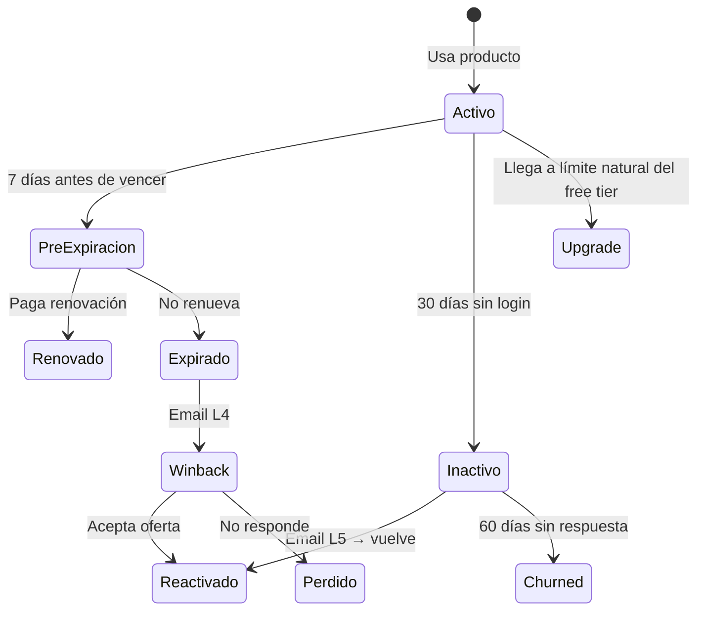
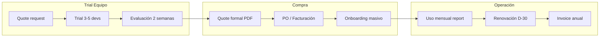

# SoulCore Store — Plan de Emails y Comunicaciones

> Documento generado por reunión de 6 agentes: Email Architect, Client Dev, Client Enterprise, Client Free User, Platform UX Strategist, Security Engineer.
> Fecha: 2026-04-08

---

## Arquitectura General



---

## Familia 1: Transaccionales — Cuenta

Emails relacionados con la cuenta del usuario. NO requieren opt-in (son necesarios para el servicio).



### Emails de esta familia

| ID | Nombre | Template | Trigger | Contenido | Timing |
|----|--------|----------|---------|-----------|--------|
| T1 | `welcome` | base-transactional | Registro de cuenta | Logo + "Bienvenido a SoulCore" + verificar email + link dashboard | Inmediato |
| T2 | `verify-email` | base-transactional | Click "reenviar verificación" | Token/link verificación (expira 24h) | Inmediato |
| T10 | `password-reset` | base-transactional | Solicitud reset | Link reset (expira 1h) + "Si no fuiste tú, ignora" | Inmediato |

### Datos necesarios
- `email`, `name`, `locale`, `verification_token`, `reset_token`

---

## Familia 2: Transaccionales — Compra y Licencia

Emails relacionados con la adquisición de productos. El corazón del negocio.



### Emails de esta familia

| ID | Nombre | Template | Trigger | Contenido | Timing |
|----|--------|----------|---------|-----------|--------|
| T3 | `purchase-single` | base-receipt | Whop webhook (one_time) | Recibo PDF + license key + link descarga firmado + specs producto | Inmediato |
| T3-free | `free-license` | base-transactional | POST /api/free-license | License key + link descarga + link repo GitHub | Inmediato |
| T4 | `subscription-start` | base-receipt | Whop webhook (renewal) | Recibo + license key + período + fecha próximo cobro + link portal | Inmediato |
| T8 | `license-activated` | base-transactional | Machine binding | "Licencia activada en [device]" + dispositivos restantes + link gestión | Inmediato |
| T9 | `license-revoked` | base-transactional | Admin revoca | Motivo + alternativas + link soporte | Inmediato |

### Datos necesarios
- `email`, `name`, `product_name`, `product_slug`, `license_key`, `price_formatted`, `receipt_url`, `download_url`, `subscription_period`, `next_billing_date`, `machine_count`, `max_machines`

---

## Familia 3: Transaccionales — Billing y Pagos

Gestión de pagos, renovaciones, fallos, reembolsos.



### Emails de esta familia

| ID | Nombre | Template | Trigger | Contenido | Timing |
|----|--------|----------|---------|-----------|--------|
| T5 | `subscription-renewed` | base-receipt | Whop renewal webhook | Recibo + confirmación próximo ciclo + monto | Inmediato |
| T6 | `payment-failed` | base-transactional | Whop payment failed | Alerta + link Whop para actualizar método + "tienes X días" | Inmediato, retry D+3, D+7 |
| T7 | `subscription-cancelled` | base-transactional | Whop went_invalid | Confirmación + fecha fin acceso + "puedes reactivar hasta [fecha]" | Inmediato |
| T11 | `refund-issued` | base-receipt | Admin/Whop refund | Monto reembolsado + licencia desactivada + timeline | Inmediato |

### Datos necesarios
- `email`, `name`, `product_name`, `amount_formatted`, `currency`, `next_billing_date`, `access_end_date`, `payment_update_url`, `refund_amount`

---

## Familia 4: Transaccionales — Producto

Actualizaciones de producto, nuevas versiones, changelog.



### Emails de esta familia

| ID | Nombre | Template | Trigger | Contenido | Timing |
|----|--------|----------|---------|-----------|--------|
| T12 | `product-update` | base-transactional | Admin publica versión | Changelog resumido + link descarga + "qué hay nuevo" | Al publicar |

### Datos necesarios
- `email`, `name`, `product_name`, `old_version`, `new_version`, `changelog_summary`, `download_url`

---

## Familia 5: Lifecycle — Onboarding y Activación

Emails que guían al usuario nuevo. Requieren opt-in marketing (excepto L1 que es parte del servicio).



### Emails de esta familia

| ID | Nombre | Template | Trigger | Contenido | Timing |
|----|--------|----------|---------|-----------|--------|
| L1 | `onboarding-quickstart` | base-marketing | Registro + no activó en 48h | Guía paso a paso + código ejemplo + "5 minutos para empezar" | D+1 (si activó: skip) |
| L2 | `tip-tecnico` | base-marketing | D+7 post-registro | Caso de uso avanzado + integración con herramienta popular | D+7 |
| L6 | `nps-survey` | base-marketing | D+30 post-registro | "¿Qué tan probable es que recomiendes SoulCore?" (1-10) + campo libre | D+30 |

### Reglas (del cliente dev):
- **Máximo 3-4 emails el primer mes**
- Si el usuario activó el producto rápido, skip L1
- Tips deben ser técnicos reales, no marketing disfrazado

---

## Familia 6: Lifecycle — Retención y Revenue

Emails para mantener usuarios activos y generar upgrades.



### Emails de esta familia

| ID | Nombre | Template | Trigger | Contenido | Timing |
|----|--------|----------|---------|-----------|--------|
| L3 | `subscription-expiring` | base-marketing | Suscripción vence en 7 días | "Tu licencia de [producto] vence el [fecha]" + CTA renovar | D-7, D-1 |
| L4 | `winback` | base-marketing | Canceló suscripción | "Qué hay nuevo desde que te fuiste" + oferta especial | D+7 post-cancel |
| L5 | `re-engagement` | base-marketing | 30 días sin login | "¿Sigues usando [producto]?" + novedades + link directo | D+30, D+60 |

### Reglas (del cliente free user):
- **El upgrade debe sentirse natural, no forzado**
- Mostrar límite alcanzado, no popup de venta
- Máximo 1 email de lifecycle por mes post-onboarding
- Win-back: máximo 2 intentos, luego silencio

---

## Familia 7: Enterprise

Emails específicos para clientes corporativos.



### Emails enterprise (adicionales a los anteriores)

| ID | Nombre | Template | Trigger | Contenido |
|----|--------|----------|---------|-----------|
| E1 | `team-trial-invite` | base-transactional | Admin invita dev al trial | "Tu equipo te invitó a probar [producto]" + setup |
| E2 | `quote-formal` | base-receipt | Solicitud de quote | PDF: desglose seats, precio unitario, descuento volumen, total anual |
| E3 | `seats-usage-report` | base-transactional | Mensual (cron) | X/Y seats usados + quién activó + recomendación |
| E4 | `renewal-notice-enterprise` | base-transactional | D-30 antes de vencer | "Su contrato vence el [fecha]" + quote renovación adjunto |

### Documentos necesarios (PDFs generables):
- Quote formal con desglose
- Invoice/factura con datos fiscales
- DPA (Data Processing Agreement)
- SLA document

---

## Templates Base HTML

### 1. `base-transactional`
```
┌─────────────────────────────┐
│  [Logo SoulCore]            │
├─────────────────────────────┤
│                             │
│  Hola {name},               │
│                             │
│  {contenido principal}      │
│                             │
│  [CTA Button]               │
│                             │
├─────────────────────────────┤
│  SoulCore Dev               │
│  soulcore.dev               │
│  {dirección física}         │
└─────────────────────────────┘
```
- Sin imágenes pesadas, max 600px ancho
- Dark mode compatible (prefers-color-scheme)
- Plain text fallback automático

### 2. `base-receipt`
```
┌─────────────────────────────┐
│  [Logo] RECIBO              │
├─────────────────────────────┤
│  Producto: {name}           │
│  Monto:    {price}          │
│  Fecha:    {date}           │
│  Ref:      {order_id}       │
├─────────────────────────────┤
│  License Key:               │
│  ┌─────────────────────┐    │
│  │ XXXX-XXXX-XXXX-XXXX │    │
│  └─────────────────────┘    │
│                             │
│  [Descargar] [Mi Cuenta]    │
├─────────────────────────────┤
│  Footer legal               │
└─────────────────────────────┘
```

### 3. `base-marketing`
```
┌─────────────────────────────┐
│  [Logo SoulCore]            │
├─────────────────────────────┤
│  {hero image/banner}        │
│                             │
│  {contenido}                │
│                             │
│  [CTA principal]            │
│                             │
├─────────────────────────────┤
│  Footer + Unsubscribe link  │
│  "Gestionar preferencias"   │
└─────────────────────────────┘
```
- DEBE tener link de unsubscribe (CAN-SPAM/GDPR)
- DEBE tener link "gestionar preferencias"

---

## Compliance y Seguridad

### GDPR
- **Opt-in explícito** para emails marketing (checkbox desmarcado por defecto)
- **Transaccionales** no necesitan opt-in (necesarios para el servicio)
- **Unsubscribe** en 1 click, efectivo inmediato
- **Doble opt-in** recomendado para newsletters

### CAN-SPAM
- Dirección física en footer de CADA email
- Subject no engañoso
- Identificar como publicidad si es marketing

### DNS (configurar en Resend)
- **SPF**: `v=spf1 include:resend.com ~all`
- **DKIM**: activar en Resend (2048-bit)
- **DMARC**: `v=DMARC1; p=quarantine; pct=100; rua=mailto:dmarc@soulcore.dev`

### Datos del cliente

| Dato | Retención | Borrable por GDPR |
|------|-----------|-------------------|
| Email + nombre | Mientras cuenta activa | Sí (pseudoanonimizar) |
| License keys | Mientras cuenta activa | Sí (revocar + borrar) |
| Payment refs (Whop ID) | 7 años (fiscal) | No |
| IPs de activación | 90 días rolling | Sí |
| Historial compras | 7 años (fiscal) | No (montos + fechas se mantienen) |
| Email preferences | Mientras cuenta activa | Sí |

### DELETE Account Flow
1. Usuario solicita → confirmar vía email
2. Pseudoanonimizar: email → `SHA256(email+salt)`, nombre → `DELETED_USER`
3. Conservar: order_id, montos, fechas (fiscal)
4. Revocar licencias activas
5. Eliminar de listas Resend
6. Plazo: ≤30 días

### Audit Log
```sql
CREATE TABLE email_audit_log (
    id INTEGER PRIMARY KEY,
    message_id TEXT,           -- Resend message ID
    email_hash TEXT,           -- SHA256 del destinatario
    template_name TEXT,        -- "welcome", "purchase-single", etc
    status TEXT,               -- sent, bounced, opened, clicked
    consent_version TEXT,      -- versión T&C aceptada
    sent_at DATETIME,
    created_at DATETIME DEFAULT CURRENT_TIMESTAMP
);
```
Retención: 90 días transaccionales, 30 días marketing.

---

## Datos del Usuario (schema)

```sql
-- Agregar a tabla customers existente
ALTER TABLE customers ADD COLUMN name TEXT;
ALTER TABLE customers ADD COLUMN locale TEXT DEFAULT 'es';
ALTER TABLE customers ADD COLUMN email_verified INTEGER DEFAULT 0;
ALTER TABLE customers ADD COLUMN marketing_opt_in INTEGER DEFAULT 0;
ALTER TABLE customers ADD COLUMN opt_in_at DATETIME;
ALTER TABLE customers ADD COLUMN last_login_at DATETIME;
ALTER TABLE customers ADD COLUMN created_at DATETIME DEFAULT CURRENT_TIMESTAMP;

-- Preferencias de email
CREATE TABLE email_preferences (
    customer_id INTEGER PRIMARY KEY REFERENCES customers(id),
    transactional INTEGER DEFAULT 1,   -- siempre 1, no desactivable
    product_updates INTEGER DEFAULT 1,
    lifecycle INTEGER DEFAULT 1,
    marketing INTEGER DEFAULT 0,       -- opt-in explícito
    updated_at DATETIME
);
```

---

## Priorización

### P0 — Semana 1 (sin estos no hay tienda funcional)
- [ ] T1 `welcome` — Bienvenida con verificación
- [ ] T3 `purchase-single` — Recibo + license key (compra única)
- [ ] T3-free `free-license` — License key para productos gratis
- [ ] T4 `subscription-start` — Recibo + license key (suscripción)
- [ ] Template `base-transactional`
- [ ] Template `base-receipt`
- [ ] DNS: SPF + DKIM + DMARC

### P1 — Semana 2 (billing funcional)
- [ ] T5 `subscription-renewed` — Recibo renovación
- [ ] T6 `payment-failed` — Alerta pago fallido
- [ ] T7 `subscription-cancelled` — Confirmación cancelación
- [ ] T10 `password-reset` — Reset de contraseña
- [ ] L1 `onboarding-quickstart` — Guía setup
- [ ] L3 `subscription-expiring` — Recordatorio D-7

### P2 — Semana 3-4 (engagement)
- [ ] T8 `license-activated` — Device binding notification
- [ ] T12 `product-update` — Changelog nueva versión
- [ ] L2 `tip-tecnico` — Caso de uso D+7
- [ ] L5 `re-engagement` — Inactivo 30d
- [ ] Template `base-marketing`
- [ ] Email preferences page en portal
- [ ] Audit log table

### P3 — Mes 2+ (enterprise + growth)
- [ ] L4 `winback` — Recuperar churned
- [ ] L6 `nps-survey` — Encuesta satisfacción
- [ ] E1-E4 — Emails enterprise (trial, quote, seats, renewal)
- [ ] PDF generator (invoices, quotes, DPA)
- [ ] DELETE account flow
- [ ] Referral program emails

---

## Métricas a Trackear

| Métrica | Cómo | Herramienta |
|---------|------|-------------|
| Delivery rate | Resend dashboard | Resend |
| Open rate por template | Resend webhooks | SQLite audit log |
| Click rate en CTAs | Resend webhooks | SQLite audit log |
| Bounce rate | Resend suppression | Auto-cleanup |
| Spam complaints | Resend feedback loop | Alerta si >0.1% |
| Unsubscribe rate | Link tracking | SQLite preferences |
| Time to activation | license created_at - email sent_at | SQLite |
| Free→Paid conversion | Correlate free license → paid purchase | SQLite |

---

## Resumen Ejecutivo

- **22 emails** en 7 familias
- **3 templates base** HTML (transactional, receipt, marketing)
- **Provider**: Resend (ya configurado)
- **Compliance**: GDPR + CAN-SPAM + SPF/DKIM/DMARC
- **P0 en semana 1**: 4 emails + 2 templates + DNS = tienda funcional
- **Inversión total**: ~3 semanas para sistema completo
